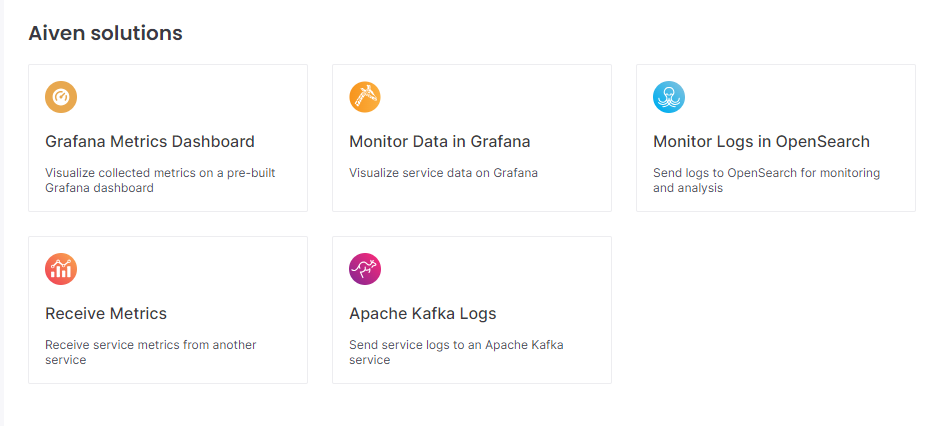

AUG 30,2023

# Aiven Quickstart: Simplify media content scanning and monitoring using Rekognition,S3,Lambda,Kafka,InfluxDB and Grafana 

*Learn how to setup a serverless Image Scanning Service using AWS Rekognition and stream its output to Kafka on Aiven for additional processing.*

Before diving into the technical stuff let's just clarify a few things.

*What is image content monitoring?*

Today's world web apps are rich on media by nature. Users are generating (and uploading) a myriad of media content every day that needs to be monitored due to a (growing) number of reasons by application owners. Among the most common ones are:

**Safety:** Prevent that harmful or inappropriate content is uploaded onto your systems. Increased media filtering and moderation are more and more required by authorities, and users. Who increasingly perceive threats on the web.

**Metadata generation:** By acquiring additional information about the media on the web, individuals, organizations and businesses can understand better how users are interacting with our systems.

Leveraging recent advances in machine learning and artificial intelligence, is now fairly simple to use technologies that can 'understand' media content. In the past we have consistently monitored system log files, now we must also think in monitoring media assets similarly.

*Why would you want to hook Apache Kafka to your monitoring implementation?*

By connecting a real-time data streaming platform with storage capabilities like Kafka, we can further ingest, aggregate and transform media data and meta-data. This opens endless possibilities to implement the most common uses cases in media monitoring but also remain flexible to adopt (or exchange) new algorithms or requirements in the long term.     

In this article we will implement a simplistic, yet effective, image processing pipeline based on cloud technologies that can easily be extended. All of that with just a few lines of code and implemented a decoupled event driven architecture. 

---

Following this guide, you will (in a nutshell):

1. Create an Apache Kafka service on Aiven 
2. Deploy a serverless function to scan images uploaded to S3 and send the results to kafka
3. Invoke a helper function to upload mock imagery for testing
4. Connect our service to a Grafana dashboard, to monitor its performance

And here is the stack of our monitoring pipeline:

- AWS S3: Used to store user image uploads and fire up events
- AWS Lambda: Serverless function to perform recognition tasks on images
- Serverless framework: Simplified cloud infrastructure management
- AWS Rekognition: Performs labeling on top of the images
- Kafka on Aiven: Managed service with outstanding stability to propagate scan results
- Grafana on Aiven: Observability dashboard used to monitor Kafka and underlying resources

**Prerequisites**

To follow this guide, you will need

- An active Aiven account
- An active AWS account and configured CLI access, make sure your IAM user has privileges in the aforementioned services
- To install the Serverless Framework (you will need to install Node/Npm first)
- An API Key from Pixabay to fetch and upload random images onto S3 for testing purposes
- Basic understanding of AWS, Python and YAML

## 1. Create an Apache Kafka service on Aiven 

a. On the Aiven web console, head to the Services menu, click on the Create service button and select Apache Kafka

b. Select an Aiven plan on the cloud provider of your choice (you can start with any of the Startup plans) and provide an easy to identify service name at the bottom of the page. We will go with 'kafka-quickstart-exercise'. The status flag of the service should display 'Running' once the setup is complete.

Note: You can use Aiven's free trial to set up the whole stack on this tutorial

c. Download and store these three credentials files from 'Connection Information' (Overview tab)

d. Navigate to the topics menu and add a new topic named 'image-scans'

## 2. Deploy a serverless function to scan images uploaded to S3 and send the results to kafka

a. Clone our serverless solution with Lambda functions from this Github repository: https://github.com/alex-alfaro/aiven-kafka-quickstart-tensorflow.git

b. In order to connect to Aiven and authenticate your messages, paste the credential files from 1.c under the 'aiven-cred' folder

c. Update the serverless.yml environment variables with your own values

d. From within the project folder execute this in your console/shell:

`$sls plugin install -n serverless-python-requirements`

This command will install a plugin that will help us to download and package all the python dependencies from Python's `requirements.txt`

c. Deploy the project to your AWS account with 

`$sls deploy`

Here Serverless is packaging our code, uploading it to AWS and configuring all the specified resources for us. This might take a couple of minutes to complete

## 3. Generate some testing data

Next, invoke the helper function to upload some mock imagery onto your S3 bucket for testing.

`$sls invoke -f uploadMockImages`

If everything went fine, you can verify that the scan outputs from Rekognition are now stored in our Kafka's topic. To see the message payloads and keys, click on the three dots from our topic row and select Topic Messages. 

Now you can fetch the messages currently on that topic (To be able to read them select FORMAT:JSON, and click 'Fetch Messages' on the top)

**Voilá, you just confirmed you are producing Kafka messages!**

## 4. Connect your Kafka service to a Grafana dashboard (via InfluxDB), to monitor its performance

a. Navigate to the integrations tab of your Kafka service and select the "Store Metrics" box. Next, on the pop-up window select the "New Service" option. Select your plan and assign a relevant name and Aiven will spin up an instance of InfluxDB (timeseries database) already connected and receiving metrics from your Kafka service with a predefined schema.

b. Open your new InfluxDB service and under Integrations add a "Monitor Data in Grafana". 

Once again, select the "new service" option and assign it an Aiven plan and a name. Your Grafana instance should be ready and consuming metrics from Influx in no time.

c. To access the dashboard in Grafana, click on the service URI link in the overview section. 

This will open Grafana Web UI, to enter use the credentials available also in the overview section. Within Grafana navigate to Dashboards -> Browse and select the dashboard pre-configured dashboard.

**Now you are able to monitor (in real-time!) all the System, Kafka and Java metrics from the system!**

You should see an spike in resources consumption every time you execute the function mentioned in 3.

> Note: Observability in distributed systems is extremely important to know how your system is performing in overall, as well as to find optimization opportunities or resolve issues.

## UNDER THE HOOD

Now you might be wondering what is actually happening with the code in the repo. Here are the most important snippets explained.

**Serverless.yml**

`
functions:
  uploadMockImages:
    handler: handlers/uploadMockImagesHandler.uploadImages
    timeout: 60
  scanImageOnUpload:
    handler: handlers/imageUploadHandler.scanImage
    events:
      - s3:
          bucket: ${self:provider.environment.IMAGES_BUCKET}
          event: s3:ObjectCreated:*
          rules:
            - suffix: .jpg
`

On this section of the serverless specs, we are defining two lambda functions. A helper function to generate image upload events. The second is far more relevant. It triggers based on an upload event (only jpg images will trigger it) from our images bucket.

**imageUploadHandler.py**

`
def scanImage(event, context):

    TOPIC_NAME = "image-scans"

    producer = KafkaProducer(
        ...
    )
    
    ...
    
    for file in files:
        file_name = file["s3"]["object"]["key"]

        ...

        response = rekognition_client.detect_labels(
            Image={
                'S3Object':
                    {
                        'Bucket':bucket,
                        'Name':file_name
                    }
            },
            MaxLabels=5
        )

        outputs.append(
             {
               'imageKey':file_name,
                'labels':response["Labels"]
            }
        )

        producer.send(
            topic=TOPIC_NAME,
            key=str(uuid.uuid4()),
            value=json.dumps(outputs)
        )

    producer.close()

    ...
`

In this function, we iterate over the image files received from the upload event. Invoke Rekognition service to obtain the resulting metadata (labels) and send a kafka message asynchronously with a unique key and the scan results as payload.

**uploadMockImagesHandler.py**

`
def uploadImages(event,context):

    ...

    bucket_name = os.environ['IMAGES_BUCKET']
    bucket = s3.Bucket(bucket_name)
    uploads=0

    for hit in lookup['hits']:
        imageURL = hit['largeImageURL']
        image = requests.get(imageURL, stream=True)
        file_name = hit['previewURL'].split('/')[-1]
        bucket.upload_fileobj(image.raw, file_name)
        uploads += 1

    ...
`

Our helper function simply fetches a set of images from Pixabay and uploads them onto S3 to start the execution of our pipeline.

Thanks a lot for staying with me until the end. Have fun adding new features to your monitoring pipeline!

